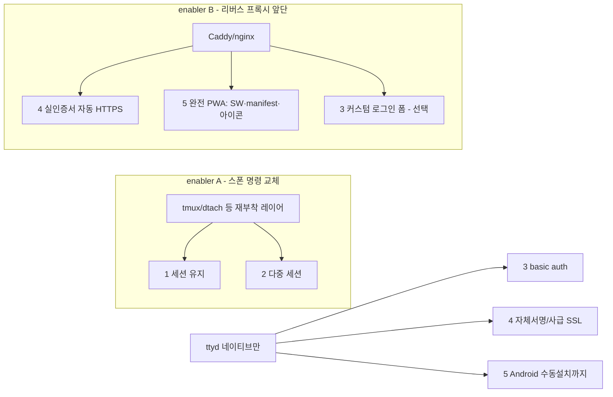

# 업그레이드 계획 — 세션 지속 · 다중 세션 · 로그인 · HTTPS · PWA

대상: `public/index.html` + 런처 6곳 (± 리버스 프록시 신규 계층)
상태: **검토 완료 / 구현 미착수** (2026-07-04). 본 문서는 실현 가능성 판정과 구현 경로를 확정하기 위한 계획서다. 구현 착수 전 §8 미결 결정사항을 먼저 정해야 한다.
전제: 번들 ttyd **1.7.7-40e79c7** 옵션 셋 실측(`ttyd.exe --help`), 현행 클라이언트/런처 코드 실독 기준.

## 1. 목표

모바일 래퍼에 다음 5개 기능을 보강한다.

1. 웹 터미널이 닫혀도 **세션이 백그라운드에서 유지**되고 재접속 시 복원.
2. **다중 세션 생성 · 세션 간 전환** 관리 UI.
3. **로그인** — 단일 계정, 다기기 동시접속 허용, 권한 차등 없음.
4. **SSL(HTTPS)** — 포트포워딩으로 외부 공개해도 안전.
5. **PWA** — 모바일에서 앱으로 설치.

## 2. 요약 판정

| # | 항목 | 판정 | 난이도 | 클라이언트 수정 | 핵심 관문 |
|---|------|------|--------|----------------|-----------|
| 1 | 세션 백그라운드 유지 | **Unix 가능 / Windows 블로커** | Unix 中 · Win 上上 | 없음(Unix) | 스폰 명령을 재부착형 세션 레이어로 교체 |
| 2 | 다중 세션 · 전환 UI | **Unix 조건부 / Windows 블로커** | 中~上 | 있음 | 1번 위에 얹힘. 폴리시 UI는 tmux control mode |
| 3 | 로그인(단일계정·다기기) | **가능** | 下 | 없음 | ttyd `-c` basic auth + HTTPS 동반 |
| 4 | SSL/HTTPS 공개노출 | **가능** | 下(자체) / 中(실인증서) | 없음 | ttyd `-S/-C/-K` 네이티브, 공개는 프록시 권장 |
| 5 | PWA 앱 설치 | **부분(인라인) / 완전은 조건부** | 中 | 있음 | `-I`가 SW·manifest 별도 URL 서빙 불가 |

핵심 사실 (근거):

- ttyd `-I`는 **단일 index.html만 교체**하며 일반 정적 파일 디렉터리 서빙이 없다 — 공식 이슈 #181 "not planned". → SW/manifest/아이콘을 실제 URL로 못 낸다.
- ttyd는 **접속마다 새 자식 프로세스를 스폰**하고 연결 종료 시 `-s`(기본 SIGHUP)로 죽인다. 옵션만으로 같은 프로세스 재부착 불가.
- Service Worker는 **data:/blob: URI로 등록 불가**(W3C 스펙: http/https 스킴만). 실제 서빙되는 `/sw.js`가 필요.
- ttyd `-c user:pass` basic auth는 **무상태** → 여러 기기가 같은 계정으로 동시 접속 가능.
- 클라이언트는 이미 `https:`→`wss:` 자동 전환(`index.html:615`)과 `/token`→`AuthToken` 핸드셰이크(`594-601`, `626-627`)를 구현 중.

## 3. 아키텍처 — 두 개의 갈림길

5개 항목은 두 개의 도입 결정으로 수렴한다.

- **enabler A (스폰 명령 → tmux류)**: 1·2 해결. **Unix 전용.** Windows PowerShell엔 등가물 없음 → 블로커.
- **enabler B (리버스 프록시, Caddy 권장)**: 4(실인증서 자동갱신)·5(완전 PWA)·3(커스텀 폼)을 한 번에 해결하나, "백엔드 0 / 단일 HTML" 철학을 포기하고 Windows 서비스 구성이 2계층(프록시+ttyd)으로 복잡해진다.
- **네이티브만 유지**: 3(basic auth) + 4(자체서명/사급 인증서) + 5(Android 수동 설치)까지는 프록시 없이 달성.

## 4. 항목별 상세 계획

### 4.1 세션 백그라운드 유지 (항목 1)

**메커니즘.** 지속 상태를 ttyd 자식이 아니라 별도 데몬(tmux 서버 등)이 소유하게 한다. 스폰 명령을 `<shell>` → `tmux new -A -s <name>` 형태로 교체하면 ttyd 자식(tmux 클라이언트)만 붙었다 떨어지고, 그 안의 셸·프로그램은 tmux 서버에 남아 재접속 시 재부착된다. `-A` = 있으면 attach, 없으면 create.

**플랫폼별.**

| 플랫폼 | 실현성 | 방법 |
|--------|--------|------|
| Linux | ✅ 높음 | `tmux new -A -s main` (패키지 기본 제공) |
| macOS | ✅ 높음 | `tmux new -A -s main` (`brew install tmux`) |
| Windows | ❌ **블로커** | tmux/dtach/abduco/zellij 전부 유닉스 전용. §8-D 참조 |

**손댈 지점** (스폰 명령을 바꾸는 곳 — 항목 3·4도 동일 라인에 인자를 추가):

| 파일 | 위치 | 현재 | 비고 |
|------|------|------|------|
| `linux/ttyd.sh` | `:15` | `… bash -l` | 수동 실행 |
| `linux/ttyd-wrapper.service` | `:7` ExecStart | `… bash -l` | 유닛 템플릿 |
| `macos/ttyd.sh` | `:14` | `… zsh -l` | 수동 실행 |
| `macos/ttyd-wrapper.plist` | `:10-23` ProgramArguments | `zsh -l` | 배열 항목 추가 |
| `bin/ttyd.bat` | `:1` | `… powershell.exe` | Windows 수동(블로커) |
| `bin/install-service.bat` | `:55`(echo) · `:102`(set) | `… %SHELL_CMD%` | NSSM AppParameters 2곳 |

**리스크.**
- 고정 세션명이면 여러 기기가 **한 화면을 미러링**(tmux 특성). 기기별 독립이 필요하면 세션명 분리 전략 필요 → 항목 2와 연동.
- tmux 상태줄이 하단 1줄을 차지 → 모바일 세로 공간. `set -g status off` 또는 커스텀 상태줄 고려.
- tmux 프리픽스(`Ctrl-b`)와 스티키 Ctrl UX 충돌 가능 → 툴바에 전용 버튼 제공 권장.
- 클라이언트 수정 **불필요**(순수 서버측 명령 교체).

### 4.2 다중 세션 · 전환 UI (항목 2)

항목 1 위에 얹힌다 — 같은 관문(Unix 전용/Windows 블로커)을 공유.

**구현 선택지 (Unix, tmux 채택 전제).**

| 수준 | 방법 | 비용 | 클라이언트 작업 |
|------|------|------|----------------|
| 저비용 | 툴바에 tmux 프리픽스 매크로 버튼(`Ctrl-b c`/`n`/`p`/`w`) | 下 | `KEYDEFS`(`index.html:780-807`)에 `data-seq` 추가 + 마크업 버튼 |
| 고비용 | tmux **control mode**(`tmux -CC`) 파싱 레이어 or 세션 관리 백엔드 API | 上 | 신규 세션 패널·프로토콜 파서 |

**손댈 지점 (저비용 경로).**
- 마크업: `index.html:416-488` — 새 "세션" mode-pane 또는 특수키 줄에 버튼.
- CSS: `index.html:331-345` — `data-mode` 셀렉터 패턴 재사용.
- JS: `setMode`(`899-914`)·`KEYDEFS`(`780-807`) 확장, 위임 리스너(`880-892`) 그대로 활용.

**리스크.**
- 폴리시 UI(목록/생성/이름변경/종료)는 control mode 파서 = 상당한 신규 작업.
- 세션명 정책(공유 vs 독립)이 항목 1·3과 얽힘 → §8-A에서 확정.

### 4.3 로그인 — 단일계정·다기기 (항목 3)

**메커니즘.** ttyd `-c username:password` = HTTP Basic Auth. 무상태이므로 같은 자격증명을 가진 **여러 기기·브라우저가 동시 접속 가능**(요구사항 정확히 충족). 현행 클라이언트는 `/token` 취득 후 핸드셰이크에 `AuthToken`을 실어보내며(ttyd 토큰 기구는 basic auth와 연동) **무수정으로 동작**.

**손댈 지점.**
- 6개 런처의 ttyd 호출에 `-c "%CRED%"` 인자 추가 (§4.1 표와 동일 라인).
- `bin/install-service.bat:15-19` Configuration 블록에 `set "CRED=user:pass"` 추가.
- Linux/macOS: `TTYD_CRED` 환경변수 오버라이드 패턴(현행 `TTYD_PORT`와 동일).

**필수 동반 / 한계.**
- basic auth는 base64 평문 → **반드시 항목 4(HTTPS)와 함께.** HTTP 공개노출은 자격증명 노출.
- 브라우저 네이티브 인증 팝업(커스텀 폼 아님), 로그아웃 UX 빈약, 자격증명 매 요청 전송.
- 커스텀 로그인 폼·세션 쿠키·로그아웃이 필요하면 리버스 프록시/인증 백엔드(enabler B). `-H auth-header`로 프록시 위임 경로도 존재.
- 자격증명 저장: 평문 배치/plist에 남으므로 파일 권한·`.gitignore` 주의.

### 4.4 SSL/HTTPS 공개노출 (항목 4)

**메커니즘.** ttyd 네이티브 `-S -C cert.pem -K key.pem`. 클라이언트는 `location.protocol==='https:'`면 `wss:`로 붙음(`index.html:615`) → **무수정**.

| 방식 | 난이도 | 적합성 |
|------|--------|--------|
| 자체서명 인증서 | 下 | 즉시 가능. 브라우저 경고 + iOS/PWA 부적합 |
| 사급(수동 배치) 인증서 | 下 | 도메인 보유 시. 갱신 수동 |
| 리버스 프록시 자동 HTTPS(Caddy/nginx+certbot) | 中 | **공개노출 정석.** Let's Encrypt 자동갱신. 5·3 동시 해결 |

**중요.** ttyd는 ACME(자동 발급/갱신)를 못 한다 → 실인증서 자동화는 enabler B 필요.

**손댈 지점.**
- 네이티브: 6개 런처에 `-S -C … -K …` 추가. `install-service.bat` Configuration에 인증서 경로 변수.
- 방화벽: 현행 규칙(TCP 33322)은 LAN 기준 — 포트포워딩 시 노출면 재검토.

**공개노출 보안 체크리스트 (권장).**
- `-c`(인증) **필수** + TLS + `-O`(check-origin) + `-m`(max-clients 상한) + fail2ban/역방향 rate-limit.
- 세션 지속(항목 1) 도입 시 공개면에서 방치된 셸이 상시 살아있음을 인지 — 인증 강도 상향.

### 4.5 PWA 앱 설치 (항목 5)

**관문.** `-I` 단일파일 서빙(§2). SW·manifest·아이콘을 실제 URL로 못 낸다.

**요소별 분해.**

| 요소 | 인라인 가능? | 비고 |
|------|-------------|------|
| manifest | ✅ | `<link rel="manifest" href="data:application/manifest+json,…">` (Chrome data URI 지원). 아이콘도 data URI |
| meta(standalone 등) | ✅ | `apple-mobile-web-app-capable` 이미 설정(`index.html:6`) |
| service worker | ❌ | data:/blob: 등록 불가. 실제 `/sw.js` 필요 → `-I`로 불가 |

**설치 경로별 결과 (전제: HTTPS 필수 = 항목 4 선행).**

| 경로 | 요건 | 현 구조 |
|------|------|---------|
| Android Chrome 메뉴 "설치" | manifest + HTTPS + 아이콘 (SW 불요, Chrome 108+) | ✅ **인라인만으로 달성** |
| 자동 설치 배너(`beforeinstallprompt`) | fetch 핸들러 SW 필수 | ❌ 실 `/sw.js` 필요 → enabler B |
| 오프라인 캐싱 | SW 필수 | ❌ enabler B |
| iOS Safari 홈화면 | manifest/SW 무관, standalone 동작 | △ 아이콘은 실 `apple-touch-icon` URL 필요(data URI 무시, 기존 한계) |

**결론.** HTTPS 하에서 **Android 수동 설치 + standalone 전체화면까지는 현 단일파일 구조로 인라인 달성**. **자동 배너·오프라인·iOS 깨끗한 아이콘**은 SW/실파일 서빙(enabler B) 필요.

**손댈 지점.**
- head `index.html:3-11`: manifest `<link>` + 아이콘/테마 메타 추가.
- app JS init 부근(`~1133`): `navigator.serviceWorker.register('/sw.js')` — 단 서빙 계층 확보 후.
- enabler B 도입 시: `/sw.js`, `/manifest.webmanifest`, `/icon-512.png` 실파일 + 프록시 라우팅.

## 5. 권장 구현 단계

의존성 순서를 반영한 단계. 각 단계는 독립 배포 가능.

| Phase | 범위 | 선행 | enabler |
|-------|------|------|---------|
| P1 | **HTTPS(자체서명/사급)** + **basic auth** | — | 네이티브 |
| P2 | **PWA 인라인**(manifest+아이콘, Android 수동설치) | P1(HTTPS) | 네이티브 |
| P3 | **세션 유지**(Unix: tmux 명령 교체) | — | enabler A |
| P4 | **다중 세션 UI**(Unix: 저비용 매크로 → 선택적 고비용) | P3 | enabler A |
| P5(선택) | **리버스 프록시**(실인증서 자동 HTTPS + 완전 PWA/SW + 커스텀 로그인) | — | enabler B |
| P-Win(별건) | **Windows 세션 유지 방향 결정 후 구현** | §8-D | — |

- P1·P2·P3는 상호 독립이라 병렬 진행 가능. P4는 P3 의존.
- P5는 4·5·3의 "완성도 상한"을 올리는 선택지. 도입 시 P1(네이티브 SSL)·P2(인라인 PWA)를 대체/흡수.

## 6. 검증 기준 (수용)

- **P1**: `https://<host>:port` 접속 시 `wss` 연결·터미널 동작, 잘못된 자격증명 거부, 두 기기 동시 로그인 각자 동작.
- **P2**: Android Chrome에서 메뉴 "앱 설치" 노출·설치·standalone 실행. Lighthouse manifest 항목 통과(아이콘 512 포함).
- **P3**: 브라우저 종료→재접속 시 이전 셸 상태(실행 중 프로세스·스크롤백) 복원. 연결 끊김 후에도 서버측 프로세스 생존(`tmux ls` 확인).
- **P4**: 세션 2개 생성→전환→각자 독립 상태 유지→종료.
- **P5**: 공인 도메인 실인증서 자동 발급·갱신, `beforeinstallprompt` 발화, 오프라인 셸(캐시된 UI) 로드.
- **공개노출**: 외부망에서 인증 없이는 접근 불가, origin 위조 거부(`-O`).

## 7. 근거 / 참고

- ttyd 1.7.7 옵션: `bin/ttyd.exe --help` 실측 (`-c`, `-S/-C/-K/-A`, `-s`, `-b`, `-H`, `-m`, `-O`, `-I`).
- ttyd 정적파일 미지원: GitHub issue tsl0922/ttyd#181 (closed, not planned).
- Chrome 설치요건: developer.chrome.com/blog/update-install-criteria (SW fetch 요건 메뉴설치서 삭제 108/112, 자동배너는 유지).
- SW 등록 스킴 제약: W3C ServiceWorker 스펙 / Chromium·Mozilla 버그트래커(data:/blob: 거부).
- tmux 지속 패턴: `tmux new -A -s <name>`.
- 현행 코드: `public/index.html`(핸드셰이크 594-633, wss 615, KEYDEFS 780-807, setMode 899-914, init 1133), 런처 6곳(§4.1 표).

## 8. 미결 결정사항 (구현 착수 전 확정)

- **A. 세션 공유 정책** — 다기기 동시접속 시 같은 세션 미러링 vs 기기별 독립 세션. 항목 1·2·3의 세션명 전략을 좌우.
- **B. 리버스 프록시 도입 여부(enabler B)** — "백엔드 0 / 단일 HTML" 철학 유지 vs 4·5·3 완성도. 도입 시 Windows 서비스 2계층화.
- **C. 인증서 전략** — 자체서명(내부망) / 사급 수동(도메인) / 프록시 자동(공개).
- **D. Windows 세션 유지 방향(블로커 해소)** — 다음 중 택1:
  - (a) 셸을 **WSL bash + tmux**로 교체(PowerShell 포기, 유닉스 경로와 통일).
  - (b) **네이티브 포기** — 세션 유지는 Linux/macOS만 제공, Windows는 현행 비영속 유지.
  - (c) ConPTY 핸들을 붙잡는 **자체 지속 백엔드 신규 개발**(범위 과대, 비권장).
- **E. 다중 세션 UI 수준** — 저비용 매크로 버튼 vs 고비용 control mode 패널.
