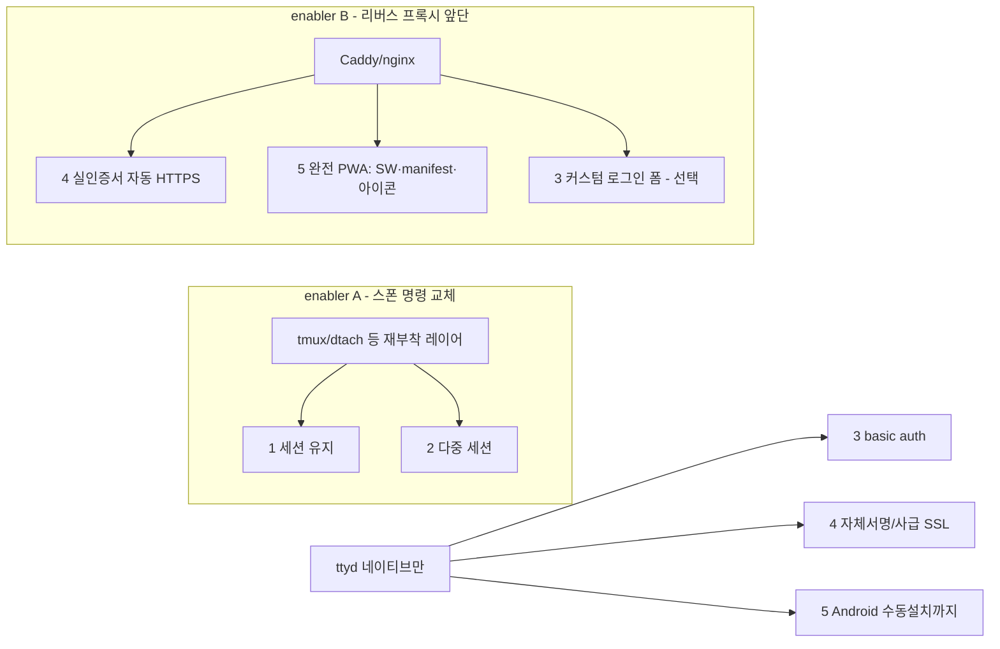
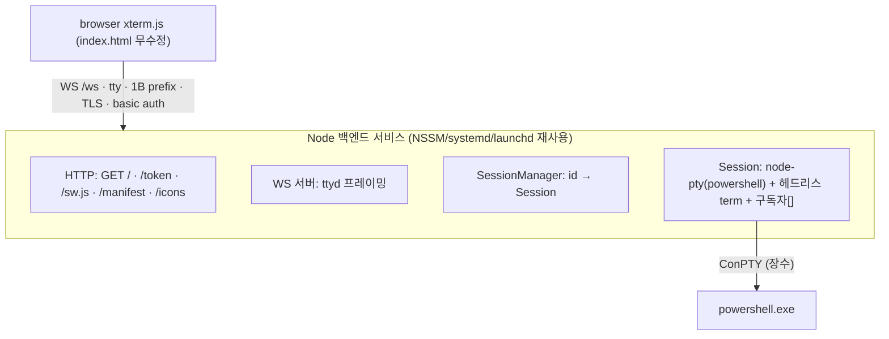

# 업그레이드 계획 — 세션 지속 · 다중 세션 · 로그인 · HTTPS · PWA

대상: `public/index.html` + 런처 6곳. (Scope B에서는 리버스 프록시 계층 없음.)
상태: **구현 완료 — Scope B(PB1·PB2·PB3)** (2026-07-04). 전체 판정(§2~§4)은 실현 상한이며, 실제 구현은 §3.5로 좁혔다. 구현 현황·검증은 **§3.6**. §8 결정 전부 확정(D=b) — Windows 세션유지는 계획대로 미구현.
전제: 번들 ttyd **1.7.7-40e79c7** 옵션 셋 실측(`ttyd.exe --help`), 현행 클라이언트/런처 코드 실독 기준.

## 1. 목표

모바일 래퍼에 다음 5개 기능을 보강한다.

1. 웹 터미널이 닫혀도 **세션이 백그라운드에서 유지**되고 재접속 시 복원.
2. **다중 세션 생성 · 세션 간 전환** 관리 UI.
3. **로그인** — 단일 계정, 다기기 동시접속 허용, 권한 차등 없음.
4. **SSL(HTTPS)** — 포트포워딩으로 외부 공개해도 안전.
5. **PWA** — 모바일에서 앱으로 설치.

## 2. 요약 판정

| # | 항목 | 판정 | 난이도 | 클라이언트 수정 | 핵심 관문 |
|---|------|------|--------|----------------|-----------|
| 1 | 세션 백그라운드 유지 | **Unix 가능 / Windows 블로커** | Unix 中 · Win 上上 | 없음(Unix) | 스폰 명령을 재부착형 세션 레이어로 교체 |
| 2 | 다중 세션 · 전환 UI | **Unix 조건부 / Windows 블로커** | 中~上 | 있음 | 1번 위에 얹힘. 폴리시 UI는 tmux control mode |
| 3 | 로그인(단일계정·다기기) | **가능** | 下 | 없음 | ttyd `-c` basic auth + HTTPS 동반 |
| 4 | SSL/HTTPS 공개노출 | **가능** | 下(자체) / 中(실인증서) | 없음 | ttyd `-S/-C/-K` 네이티브, 공개는 프록시 권장 |
| 5 | PWA 앱 설치 | **부분(인라인) / 완전은 조건부** | 中 | 있음 | `-I`가 SW·manifest 별도 URL 서빙 불가 |

핵심 사실 (근거):

- ttyd `-I`는 **단일 index.html만 교체**하며 일반 정적 파일 디렉터리 서빙이 없다 — 공식 이슈 #181 "not planned". → SW/manifest/아이콘을 실제 URL로 못 낸다.
- ttyd는 **접속마다 새 자식 프로세스를 스폰**하고 연결 종료 시 `-s`(기본 SIGHUP)로 죽인다. 옵션만으로 같은 프로세스 재부착 불가.
- Service Worker는 **data:/blob: URI로 등록 불가**(W3C 스펙: http/https 스킴만). 실제 서빙되는 `/sw.js`가 필요.
- ttyd `-c user:pass` basic auth는 **무상태** → 여러 기기가 같은 계정으로 동시 접속 가능.
- 클라이언트는 이미 `https:`→`wss:` 자동 전환(`index.html:615`)과 `/token`→`AuthToken` 핸드셰이크(`594-601`, `626-627`)를 구현 중.

## 3. 아키텍처 — 두 개의 갈림길

5개 항목은 두 개의 도입 결정으로 수렴한다.

- **enabler A (스폰 명령 → tmux류)**: 1·2 해결. **Unix 전용.** Windows PowerShell엔 등가물 없음 → 블로커.
- **enabler B (리버스 프록시, Caddy 권장)**: 4(실인증서 자동갱신)·5(완전 PWA)·3(커스텀 폼)을 한 번에 해결하나, "백엔드 0 / 단일 HTML" 철학을 포기하고 Windows 서비스 구성이 2계층(프록시+ttyd)으로 복잡해진다.
- **네이티브만 유지**: 3(basic auth) + 4(자체서명/사급 인증서) + 5(Android 수동 설치)까지는 프록시 없이 달성.

## 3.5 Scope B — 채택 실장 범위 (축소, 2026-07-04 결정)

전체 판정(§2~§4)은 상한을 서술한다. 실제 구현은 아래 4개 제약으로 범위를 좁힌다.

**채택 제약**
1. 다중 세션 포기 — **단일 터미널 세션의 백그라운드 유지만** 구현(항목 2 제외).
2. 다기기 동시접속 = **같은 세션 미러링**(독립 세션 아님).
3. PWA에서 **자동 설치 배너 · 오프라인 캐싱 · iOS 깨끗한 홈 아이콘 포기** → Android 수동 설치 + standalone만.
4. **리버스 프록시 미설치**(nginx/Caddy 등 별도 서버 배제).

**연쇄 효과 (삭감 / 잔존)**

| 전체 계획 요소 | Scope B |
|---|---|
| enabler B(리버스 프록시)·P5 | **삭제** |
| 항목 2 다중 세션·P4·control mode | **삭제** |
| Service Worker·오프라인·자동 배너·iOS 아이콘 | **삭제** → `/sw.js`·정적 서빙 불필요 → 프록시 불필요 |
| P1 HTTPS + basic auth | 잔존(네이티브) |
| P2 PWA 인라인(manifest + **512 아이콘 추가**, Android 수동설치·standalone) | 잔존(축소형) |
| P3 세션 유지(단일 고정 세션 + 미러링) | 잔존 — **Unix만** |
| 로그인(항목 3) | 불변, 미러링과 정합 |

**핵심 파생 결정**
- **③이 SW를 안 부르므로 ④(프록시 미설치)가 성립**한다 — 축소안의 중심 도미노.
- **신뢰 인증서는 여전히 필요**: PWA 설치·안전한 공개는 유효 TLS를 요구하고, 자체서명은 Chrome이 secure-context로 불인정 → 설치 불가. 프록시 없이 조달하는 법 = **공용 도메인 + `acme.sh`/`certbot`의 cert-only 발급·자동 갱신**(프록시 아님) 후 ttyd `-C/-K`에 주입. Let's Encrypt는 순수 IP에 발급하지 않음(§8-C).
- **미러링 리사이즈 경합**(제약 2의 비용): 크기가 다른 기기가 동시 접속하면 tmux가 grid 하나만 유지 → 작은 쪽 기준 뭉갬/letterbox, 현행 per-client `fit()`(`index.html:707-733`)이 크기 밀당 유발. 완화: tmux `setw -g window-size largest`(모두 전체를 보되 작은 화면은 잘림) 또는 "1기기 주도·나머지 관전" 수용.
- **512×512 아이콘**: Android 설치 요건. 현재 인라인 아이콘은 16/32/180/192뿐 → `icon.png`에서 512 생성해 manifest에 data URI 추가(HTML 용량 증가 수용).
- **PWA 정상 이용 전제 (배포 안내)** — 앱 설치는 **유효한 공개 인증서 + 도메인**이 있어야 동작한다. 권장 절차:
  1. **DDNS 도메인** — 고정 IP가 없으면 DuckDNS·No-IP 등 무료 DDNS로 도메인 확보(예: `myhost.duckdns.org`) + 공유기 포트포워딩.
  2. **무료 인증서** — `acme.sh`(또는 certbot)로 Let's Encrypt/ZeroSSL 발급. 순수 IP엔 발급 불가라 위 도메인 기준. **DNS-01 챌린지**면 포트 개방 없이도 발급 가능(주요 DDNS는 API 지원).
  3. **ttyd 적용** — 발급된 `fullchain.pem`/`privkey.pem`을 `-C/-K`로 지정, `-S`로 SSL 활성. 갱신은 `acme.sh` cron/스케줄러가 자동 + 갱신 후 서비스 재시작 훅 등록.
  4. **접속** — `https://<도메인>:<포트>/` 접속 → Android Chrome에서 "앱 설치" 정상 노출.
- **전제를 못 갖추면 PWA는 제한적**: 자체서명·순수 IP(HTTP/HTTPS)로는 Chrome이 설치를 차단 → 홈화면 바로가기(북마크 수준)만 되고 standalone 설치 앱 경험은 불가. 단 특수키·폰트·터미널 등 웹 기능 자체는 그대로 동작한다.

**Scope B 실현 매트릭스**

| 기능 | Linux | macOS | Windows |
|---|---|---|---|
| 단일 세션 유지 | ✅ tmux | ✅ tmux | ❌ 미제공(D=b, 현행 비영속) |
| 다기기 미러링 | ✅ 공짜 | ✅ 공짜 | ❌ 미제공(기기별 독립 세션) |
| 로그인(단일·다기기) | ✅ `-c` | ✅ `-c` | ✅ `-c` |
| HTTPS(네이티브 + ACME 인증서) | ✅ | ✅ | ✅ |
| PWA(Android 수동설치·standalone) | ✅ | ✅ | ✅ |

**Scope B 단계**

| 단계 | 범위 | 선행 | 플랫폼 |
|---|---|---|---|
| PB1 | HTTPS(네이티브 `-S/-C/-K`, ACME 인증서) + basic auth(`-c`) | 도메인·인증서 | 전 |
| PB2 | PWA 인라인 — manifest data URI + 512 아이콘, Android 수동설치·standalone | PB1 | 전 |
| PB3 | 세션 유지 — 스폰 명령을 `tmux new -A -s ttyd`로 교체(단일·미러링) | — | Unix |
| (Windows) | 세션 유지·미러링 미제공(D=b 확정) — 로그인·HTTPS·PWA는 전 항목 적용 | — | Windows |

- PB1·PB2·PB3 상호 독립(병렬 가능). 손댈 지점은 §4.1(런처 표)·§4.3·§4.4·§4.5와 동일하되 SW·프록시 항목은 제외.

**Windows 방침 (D=b 확정)**: 세션 유지·미러링(항목 1·2)은 **미제공**(현행 비영속 유지) — 이유는 §8-D. 대신 로그인·HTTPS·PWA(항목 3·4·5)는 Windows에도 전부 적용되어 현행 대비 순수 상향. Windows에서도 세션 유지·미러링·완전 PWA까지 원하면 별도 **Scope C(부록 A)** 로 전환해야 한다. Linux/macOS는 5개 항목 전부 실현하며 프록시가 필요 없다.

## 3.6 구현 현황 (Scope B 완료 — 2026-07-04)

PB1·PB2·PB3 구현·검증 완료. Windows 세션유지(D=b)는 계획대로 미구현.

**PB1 — 로그인(basic auth) + HTTPS (전 플랫폼)**
- 런처에 opt-in 배선. Windows: `bin/ttyd.bat`·`bin/install-service.bat`의 `CRED`/`SSL_CERT`/`SSL_KEY`. Unix: `TTYD_CRED`/`TTYD_SSL_CERT`/`TTYD_SSL_KEY` 환경변수.
- 기본값 비활성 → 기존 LAN-HTTP 동작 보존. cred 지정 시 `-c`, cert+key 둘 다 지정 시 `-S -C -K`. 설치 스크립트의 HTTP verify는 scheme 자동 대응.
- **검증**: 번들 ttyd `-c`로 실측 — 무자격 **401** / 정자격 **200**. `install-service.bat /dry` 및 `install-service.sh --dry`에서 `-c "…" -S -C "…" -K "…"` 정확 합성 확인.

**PB2 — PWA 인라인 (전 플랫폼)**
- `public/index.html` head에 web manifest를 `data:application/manifest+json;base64,…`로 인라인 + 192/512 PNG 아이콘(`icon.png`에서 생성, data URI) + `display:standalone`·theme/background color.
- **검증(실측 상향)**: 헤드리스 Chrome `Page.getAppManifest` → **errors 없음**(start_url·data-URI 아이콘 포함 무오류 파싱), 192/512 아이콘 실제 디코드 확인. §4.5에서 우려한 "data-URI 아이콘 실패"보다 결과 양호 — Chrome이 인라인 manifest를 유효 처리. ttyd 서빙 시 HTTP 200·manifest 포함 확인.
- **잔존 한계**: 실제 홈화면 설치(WebAPK)는 **HTTPS(신뢰 인증서)+실기기**에서만 성립(§3.5 배포 안내). 오프라인 캐싱·자동 설치 배너는 SW 실파일 서빙 불가로 미지원(Scope C 필요). iOS 깨끗한 아이콘도 구조적 미지원.

**PB3 — 세션 유지 (Linux/macOS)**
- 수동 런처(`linux/ttyd.sh`·`macos/ttyd.sh`)와 서비스(installer 렌더)가 tmux 감지 시 스폰 명령을 `tmux new -A -s ttyd`로 교체 → 백그라운드 지속 + 다기기 미러링. tmux 부재 또는 `TTYD_TMUX=0`이면 로그인 셸 폴백.
- systemd 유닛은 `ExecStart=<ttyd> <ARGS>` 단일 렌더, LaunchAgent는 `sh -c 'exec …'` 래퍼로 가변 인자 수용.
- **검증**: `--dry`로 유닛/plist 렌더 확인(tmux stub·auth·SSL 오버라이드 반영). 실 systemd/launchd 기동은 대상 OS에서 확인 필요(호스트가 Windows).

**Windows (D=b)**: 세션유지·미러링 미구현(현행 비영속 유지). 로그인·HTTPS·PWA는 적용됨. 확장 원하면 부록 A(Scope C).

**변경 파일**: `public/index.html`, `bin/ttyd.bat`, `bin/install-service.bat`, `linux/ttyd.sh`, `linux/ttyd-wrapper.service`, `linux/install-service.sh`, `macos/ttyd.sh`, `macos/ttyd-wrapper.plist`, `macos/install-service.sh`.

## 4. 항목별 상세 계획

### 4.1 세션 백그라운드 유지 (항목 1)

**메커니즘.** 지속 상태를 ttyd 자식이 아니라 별도 데몬(tmux 서버 등)이 소유하게 한다. 스폰 명령을 `<shell>` → `tmux new -A -s <name>` 형태로 교체하면 ttyd 자식(tmux 클라이언트)만 붙었다 떨어지고, 그 안의 셸·프로그램은 tmux 서버에 남아 재접속 시 재부착된다. `-A` = 있으면 attach, 없으면 create.

**플랫폼별.**

| 플랫폼 | 실현성 | 방법 |
|--------|--------|------|
| Linux | ✅ 높음 | `tmux new -A -s main` (패키지 기본 제공) |
| macOS | ✅ 높음 | `tmux new -A -s main` (`brew install tmux`) |
| Windows | ❌ **블로커** | tmux/dtach/abduco/zellij 전부 유닉스 전용. §8-D 참조 |

**손댈 지점** (스폰 명령을 바꾸는 곳 — 항목 3·4도 동일 라인에 인자를 추가):

| 파일 | 위치 | 현재 | 비고 |
|------|------|------|------|
| `linux/ttyd.sh` | `:15` | `… bash -l` | 수동 실행 |
| `linux/ttyd-wrapper.service` | `:7` ExecStart | `… bash -l` | 유닛 템플릿 |
| `macos/ttyd.sh` | `:14` | `… zsh -l` | 수동 실행 |
| `macos/ttyd-wrapper.plist` | `:10-23` ProgramArguments | `zsh -l` | 배열 항목 추가 |
| `bin/ttyd.bat` | `:1` | `… powershell.exe` | Windows 수동(블로커) |
| `bin/install-service.bat` | `:55`(echo) · `:102`(set) | `… %SHELL_CMD%` | NSSM AppParameters 2곳 |

**리스크.**
- 고정 세션명이면 여러 기기가 **한 화면을 미러링**(tmux 특성). 기기별 독립이 필요하면 세션명 분리 전략 필요 → 항목 2와 연동.
- tmux 상태줄이 하단 1줄을 차지 → 모바일 세로 공간. `set -g status off` 또는 커스텀 상태줄 고려.
- tmux 프리픽스(`Ctrl-b`)와 스티키 Ctrl UX 충돌 가능 → 툴바에 전용 버튼 제공 권장.
- 클라이언트 수정 **불필요**(순수 서버측 명령 교체).

### 4.2 다중 세션 · 전환 UI (항목 2)

항목 1 위에 얹힌다 — 같은 관문(Unix 전용/Windows 블로커)을 공유.

**구현 선택지 (Unix, tmux 채택 전제).**

| 수준 | 방법 | 비용 | 클라이언트 작업 |
|------|------|------|----------------|
| 저비용 | 툴바에 tmux 프리픽스 매크로 버튼(`Ctrl-b c`/`n`/`p`/`w`) | 下 | `KEYDEFS`(`index.html:780-807`)에 `data-seq` 추가 + 마크업 버튼 |
| 고비용 | tmux **control mode**(`tmux -CC`) 파싱 레이어 or 세션 관리 백엔드 API | 上 | 신규 세션 패널·프로토콜 파서 |

**손댈 지점 (저비용 경로).**
- 마크업: `index.html:416-488` — 새 "세션" mode-pane 또는 특수키 줄에 버튼.
- CSS: `index.html:331-345` — `data-mode` 셀렉터 패턴 재사용.
- JS: `setMode`(`899-914`)·`KEYDEFS`(`780-807`) 확장, 위임 리스너(`880-892`) 그대로 활용.

**리스크.**
- 폴리시 UI(목록/생성/이름변경/종료)는 control mode 파서 = 상당한 신규 작업.
- 세션명 정책(공유 vs 독립)이 항목 1·3과 얽힘 → §8-A에서 확정.

### 4.3 로그인 — 단일계정·다기기 (항목 3)

**메커니즘.** ttyd `-c username:password` = HTTP Basic Auth. 무상태이므로 같은 자격증명을 가진 **여러 기기·브라우저가 동시 접속 가능**(요구사항 정확히 충족). 현행 클라이언트는 `/token` 취득 후 핸드셰이크에 `AuthToken`을 실어보내며(ttyd 토큰 기구는 basic auth와 연동) **무수정으로 동작**.

**손댈 지점.**
- 6개 런처의 ttyd 호출에 `-c "%CRED%"` 인자 추가 (§4.1 표와 동일 라인).
- `bin/install-service.bat:15-19` Configuration 블록에 `set "CRED=user:pass"` 추가.
- Linux/macOS: `TTYD_CRED` 환경변수 오버라이드 패턴(현행 `TTYD_PORT`와 동일).

**필수 동반 / 한계.**
- basic auth는 base64 평문 → **반드시 항목 4(HTTPS)와 함께.** HTTP 공개노출은 자격증명 노출.
- 브라우저 네이티브 인증 팝업(커스텀 폼 아님), 로그아웃 UX 빈약, 자격증명 매 요청 전송.
- 커스텀 로그인 폼·세션 쿠키·로그아웃이 필요하면 리버스 프록시/인증 백엔드(enabler B). `-H auth-header`로 프록시 위임 경로도 존재.
- 자격증명 저장: 평문 배치/plist에 남으므로 파일 권한·`.gitignore` 주의.

### 4.4 SSL/HTTPS 공개노출 (항목 4)

**메커니즘.** ttyd 네이티브 `-S -C cert.pem -K key.pem`. 클라이언트는 `location.protocol==='https:'`면 `wss:`로 붙음(`index.html:615`) → **무수정**.

| 방식 | 난이도 | 적합성 |
|------|--------|--------|
| 자체서명 인증서 | 下 | 즉시 가능. 브라우저 경고 + iOS/PWA 부적합 |
| 사급(수동 배치) 인증서 | 下 | 도메인 보유 시. 갱신 수동 |
| 리버스 프록시 자동 HTTPS(Caddy/nginx+certbot) | 中 | **공개노출 정석.** Let's Encrypt 자동갱신. 5·3 동시 해결 |

**중요.** ttyd는 ACME(자동 발급/갱신)를 못 한다 → 실인증서 자동화는 enabler B 필요.

**손댈 지점.**
- 네이티브: 6개 런처에 `-S -C … -K …` 추가. `install-service.bat` Configuration에 인증서 경로 변수.
- 방화벽: 현행 규칙(TCP 33322)은 LAN 기준 — 포트포워딩 시 노출면 재검토.

**공개노출 보안 체크리스트 (권장).**
- `-c`(인증) **필수** + TLS + `-O`(check-origin) + `-m`(max-clients 상한) + fail2ban/역방향 rate-limit.
- 세션 지속(항목 1) 도입 시 공개면에서 방치된 셸이 상시 살아있음을 인지 — 인증 강도 상향.

### 4.5 PWA 앱 설치 (항목 5)

**관문.** `-I` 단일파일 서빙(§2). SW·manifest·아이콘을 실제 URL로 못 낸다.

**요소별 분해.**

| 요소 | 인라인 가능? | 비고 |
|------|-------------|------|
| manifest | ✅ | `<link rel="manifest" href="data:application/manifest+json,…">` (Chrome data URI 지원). 아이콘도 data URI |
| meta(standalone 등) | ✅ | `apple-mobile-web-app-capable` 이미 설정(`index.html:6`) |
| service worker | ❌ | data:/blob: 등록 불가. 실제 `/sw.js` 필요 → `-I`로 불가 |

**설치 경로별 결과 (전제: HTTPS 필수 = 항목 4 선행).**

| 경로 | 요건 | 현 구조 |
|------|------|---------|
| Android Chrome 메뉴 "설치" | manifest + HTTPS + 아이콘 (SW 불요, Chrome 108+) | ✅ **인라인만으로 달성** |
| 자동 설치 배너(`beforeinstallprompt`) | fetch 핸들러 SW 필수 | ❌ 실 `/sw.js` 필요 → enabler B |
| 오프라인 캐싱 | SW 필수 | ❌ enabler B |
| iOS Safari 홈화면 | manifest/SW 무관, standalone 동작 | △ 아이콘은 실 `apple-touch-icon` URL 필요(data URI 무시, 기존 한계) |

**결론.** HTTPS 하에서 **Android 수동 설치 + standalone 전체화면까지는 현 단일파일 구조로 인라인 달성**. **자동 배너·오프라인·iOS 깨끗한 아이콘**은 SW/실파일 서빙(enabler B) 필요.

**손댈 지점.**
- head `index.html:3-11`: manifest `<link>` + 아이콘/테마 메타 추가.
- app JS init 부근(`~1133`): `navigator.serviceWorker.register('/sw.js')` — 단 서빙 계층 확보 후.
- enabler B 도입 시: `/sw.js`, `/manifest.webmanifest`, `/icon-512.png` 실파일 + 프록시 라우팅.

## 5. 권장 구현 단계

의존성 순서를 반영한 단계. 각 단계는 독립 배포 가능.

> **Scope B 채택 시**: 아래 표의 P4·P5는 삭제하고 P1~P3만 수행한다. Scope B 전용 단계 정의는 §3.5(PB1~PB3) 참조.

| Phase | 범위 | 선행 | enabler |
|-------|------|------|---------|
| P1 | **HTTPS(자체서명/사급)** + **basic auth** | — | 네이티브 |
| P2 | **PWA 인라인**(manifest+아이콘, Android 수동설치) | P1(HTTPS) | 네이티브 |
| P3 | **세션 유지**(Unix: tmux 명령 교체) | — | enabler A |
| P4 | **다중 세션 UI**(Unix: 저비용 매크로 → 선택적 고비용) — *Scope B: 삭제* | P3 | enabler A |
| P5(선택) | **리버스 프록시**(실인증서 자동 HTTPS + 완전 PWA/SW + 커스텀 로그인) — *Scope B: 삭제* | — | enabler B |
| P-Win(별건) | **Windows 세션 유지 방향 결정 후 구현** | §8-D | — |

- P1·P2·P3는 상호 독립이라 병렬 진행 가능. P4는 P3 의존.
- P5는 4·5·3의 "완성도 상한"을 올리는 선택지. 도입 시 P1(네이티브 SSL)·P2(인라인 PWA)를 대체/흡수.

## 6. 검증 기준 (수용)

- **P1**: `https://<host>:port` 접속 시 `wss` 연결·터미널 동작, 잘못된 자격증명 거부, 두 기기 동시 로그인 각자 동작.
- **P2**: Android Chrome에서 메뉴 "앱 설치" 노출·설치·standalone 실행. Lighthouse manifest 항목 통과(아이콘 512 포함).
- **P3**: 브라우저 종료→재접속 시 이전 셸 상태(실행 중 프로세스·스크롤백) 복원. 연결 끊김 후에도 서버측 프로세스 생존(`tmux ls` 확인).
- **P4**: 세션 2개 생성→전환→각자 독립 상태 유지→종료.
- **P5**: 공인 도메인 실인증서 자동 발급·갱신, `beforeinstallprompt` 발화, 오프라인 셸(캐시된 UI) 로드.
- **공개노출**: 외부망에서 인증 없이는 접근 불가, origin 위조 거부(`-O`).

## 7. 근거 / 참고

- ttyd 1.7.7 옵션: `bin/ttyd.exe --help` 실측 (`-c`, `-S/-C/-K/-A`, `-s`, `-b`, `-H`, `-m`, `-O`, `-I`).
- ttyd 정적파일 미지원: GitHub issue tsl0922/ttyd#181 (closed, not planned).
- Chrome 설치요건: developer.chrome.com/blog/update-install-criteria (SW fetch 요건 메뉴설치서 삭제 108/112, 자동배너는 유지).
- SW 등록 스킴 제약: W3C ServiceWorker 스펙 / Chromium·Mozilla 버그트래커(data:/blob: 거부).
- tmux 지속 패턴: `tmux new -A -s <name>`.
- 무료 인증서/DDNS: Let's Encrypt·ZeroSSL(`acme.sh`/certbot, DNS-01 무포트 발급) + DuckDNS·No-IP 등 DDNS. 공인 CA는 순수 IP에 미발급.
- 현행 코드: `public/index.html`(핸드셰이크 594-633, wss 615, KEYDEFS 780-807, setMode 899-914, init 1133), 런처 6곳(§4.1 표).

## 8. 결정사항 (전부 확정 — 2026-07-04)

- **A. 세션 공유 정책** — ✅ **Scope B 확정: 미러링**(단일 고정 세션 공유). 리사이즈 경합은 tmux `window-size`로 완화(§3.5).
- **B. 리버스 프록시 도입** — ✅ **Scope B 확정: 미도입.** 신뢰 인증서는 프록시 없이 ACME 클라이언트로 조달(→ C).
- **C. 인증서 전략** — 공개+PWA 전제 시 **DDNS 도메인 + `acme.sh`/`certbot`의 무료 인증서(Let's Encrypt/ZeroSSL) cert-only 발급·자동 갱신** 후 ttyd `-C/-K` 주입(상세 절차 §3.5 "PWA 정상 이용 전제"). 순수 IP엔 발급 불가. 도메인·인증서 미확보 시 자체서명만 가능하고 **PWA 설치 제한**(홈화면 바로가기 수준).
- **D. Windows 세션 유지 방향** — ✅ **확정: (b) Windows 비영속 유지.** 세션 유지·미러링(항목 1·2)은 Windows 미제공, Linux/macOS 전용으로 한정. Windows도 로그인·HTTPS·PWA(항목 3·4·5)는 전부 적용. 이로써 §8 미결 없음 — 남은 것은 구현.
  - 미채택 대안(기록): (a) 셸을 WSL bash+tmux로 교체(PowerShell 포기), (a′) PowerShell을 WSL/MSYS2 tmux로 interop 지속(실험적·검증 필요), (c) 자체 지속 백엔드 — Windows에서 세션유지+완전 PWA+미러링을 모두 여는 유일 경로(상세 **부록 A / Scope C**).
- **E. 다중 세션 UI 수준** — ✅ **Scope B 확정: 다중 세션 미구현**(단일 세션만).

## 부록 A. Scope C — 자체 지속 백엔드 (Windows 완전 지원 경로)

§8-D 옵션 (c)의 상세 설계. Scope B에는 과하지만, **Windows에서 세션유지·완전 PWA·깔끔한 미러링을 모두 여는 유일한 경로**다. 채택 시 프로젝트는 "ttyd 래퍼"에서 **"자체 터미널 서버"로 승격**된다.

### A.1 핵심 원리

**PTY 수명을 소켓 수명에서 분리** — 브라우저와 무관하게 살아있는 장수 프로세스가 PTY를 소유한다(= tmux 서버가 하는 일을 Windows에서 직접).

### A.2 Windows PTY 원시 API — ConPTY

- Win10 1809+ `CreatePseudoConsole(size, hIn, hOut, …)` → 입출력 파이프. `powershell.exe`를 `STARTUPINFOEX` + `PROC_THREAD_ATTRIBUTE_PSEUDOCONSOLE`로 스폰, `ResizePseudoConsole`로 리사이즈.
- 출력 파이프가 **이미 VT(ANSI) 스트림** → xterm.js 형식 그대로. 백엔드가 핸들을 붙잡는 한 PowerShell 생존.
- **FFI 직접 구현 금지 — 래퍼 사용**: `node-pty`(ConPTY + winpty 폴백, 크로스플랫폼) / Rust `portable-pty`·`conpty` crate / Go `conpty`.

### A.3 구현 형태

**형태 A — 커스텀 서버가 ttyd 프로토콜을 그대로 말함 (권장)**

- 장수 백엔드 서비스 하나(기존 서비스 인프라 재사용). HTTP/WS가 ttyd 와이어 프로토콜 구현 → `public/index.html` **무수정** 연결(`GET /`·`/token`·`WS /ws` tty subproto·1바이트 prefix).
- WS 접속 = 새 셸 스폰이 아니라 **고정 세션 attach + 현재 화면 재생**. 종료 = **구독 해제만**, ConPTY+PowerShell 생존.
- 입력`'0'`→ConPTY stdin, 리사이즈`'1'`→`ResizePseudoConsole`, 출력 펌프(리더 스레드)→전 구독자 팬아웃(= 미러링).

**형태 B — ttyd 유지 + dtach식 shim (Windows 비권장)**

- 데몬(ConPTY+PowerShell+네임드파이프+링버퍼) + attach 클라이언트(ttyd의 "명령"). ttyd 끊기면 attach 클라만 죽고 데몬 생존, 재접속 시 새 클라 재구독. ttyd의 인증/TLS/정적서빙 재사용 → 새 코드 최소.
- **함정 — 중첩 ConPTY**: ttyd가 attach 클라를 자기 ConPTY에 넣고 데몬도 자기 ConPTY를 가짐. ConPTY는 바이트 투명이 아니라 **상태 보유 VT 변환기**라, 이미 VT인 데몬 출력을 재해석·재방출 → 시퀀스 손상 위험 `[INFERENCE — 알려진 중첩 ConPTY 문제]`. Unix pty는 투명해 무문제 → **Windows에선 형태 A 채택.**

### A.4 재접속 화면 복원 (핵심 UX)

- ConPTY는 attach 시 재생을 안 해준다. 정공법: 세션별 **헤드리스 터미널 모델**(`@xterm/headless`)에 ConPTY 출력을 먹여 권위 그리드 유지 → attach 시 `SerializeAddon.serialize()`로 현재 화면을 VT로 재구성해 전송, 이후 라이브 스트림. **언제 붙어도 정확한 재그림.**
- 부수효과: 헤드리스 term이 **권위 size를 소유** → §3.5의 미러링 리사이즈 경합을 서버가 조정해 해소(클라별 `fit()` 밀당 제거).

### A.5 부수 상향

- `/sw.js`·`/manifest`·`/icon-512` **실파일 서빙 가능 → 완전 PWA**(오프라인·자동배너·iOS 실아이콘). §2의 `-I` 단일파일 관문 소멸.
- 서버가 size 소유 → **미러링 깔끔**.
- node-pty는 Linux/macOS도 지원 → 원하면 ttyd 전면 제거·**단일 코드베이스 통일** 가능(전략적 큰 결정).

### A.6 언어 선택

| 스택 | 장점 | 단점 |
|---|---|---|
| **Node** (node-pty + ws + @xterm/headless + addon-serialize) | 생태계 표준, **serialize 턴키**, 크로스플랫폼 | 런타임/네이티브모듈 번들 이슈 |
| **Rust** (portable-pty + axum/tokio-tungstenite + termwiz) | **정적 단일 바이너리**(프로젝트 철학 부합) | 화면 serialize 자작 |
| **Go** (conpty + gorilla/websocket) | 정적 바이너리 | 터미널 모델 라이브러리 빈약 |

### A.7 비용 / 리스크

- **런타임 의존 추가**: 현재 `ttyd.exe` 단일 바이너리·의존 0 → Node 설치 또는 SEA/pkg 번들. `node-pty`는 네이티브 모듈(아치별 프리빌트)이라 단일 exe 번들이 까다로움(Rust/Go는 정적 바이너리로 회피, 대신 serialize 자작).
- **ttyd 보안 표면 재구현**(basic auth·TLS·origin·token) — 감사된 ttyd 구현 상실이 최대 단점. 공개노출 대상이라 신중 필수.
- ConPTY 잡일: 리사이즈 레이스, 출력 백프레셔, 서비스 종료 시 자식 정리(고아 PowerShell 방지).
- 유지보수 성격 변화: 터미널 서버를 "설정"이 아니라 "유지".

### A.8 권장

- Scope B(축소·저위험) 유지면 (c)는 불필요 → **D=(b) 비영속**이 정합.
- "Windows 완전 지원(세션유지+완전 PWA+미러링)"이 목표면 **형태 A + Node(node-pty + headless serialize)** 가 최단 경로. 별도 스코프로 관리.

### A.9 Scope C 단계 (채택 시)

| 단계 | 범위 |
|---|---|
| PC1 | 백엔드 스캐폴드 — HTTP(정적/토큰) + WS(ttyd 프레이밍) + node-pty 단일 세션. `index.html` 무수정 연결 확인 |
| PC2 | 지속·재부착 — 세션 수명을 소켓과 분리, 헤드리스 term + serialize 스냅샷 재생 |
| PC3 | 보안 — basic auth·TLS·origin·token 재구현 + 공개노출 체크리스트(§4.4) |
| PC4 | 완전 PWA — `sw.js`/`manifest`/512 아이콘 실서빙 + 등록 |
| PC5 | 서비스화 — NSSM(win)/systemd·launchd(unix) 배선, 종료 시 자식 정리 |
| PC6(선택) | ttyd 전면 대체 여부 결정 → 전 플랫폼 통일 |
